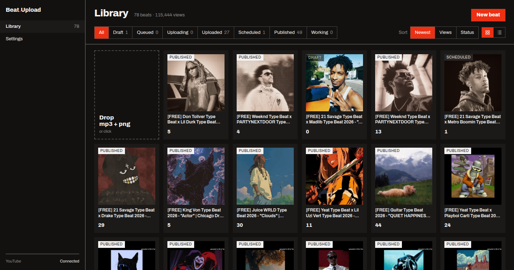

# Beat Upload

Turns a beat (audio + cover) into a 1080p video, uploads it to YouTube and tracks how it performs.



## Install

```bash
python3 -m venv .venv && source .venv/bin/activate
pip install -e .
beat-upload serve --open-browser     # http://127.0.0.1:8765
```

Needs Python 3.13, `ffmpeg` on PATH and a Google Cloud OAuth client with the YouTube Data
and Analytics APIs enabled. Connect the channel on the Settings page.

## What it does

- Drop an mp3 and a png: a Draft appears and the render starts while you write the metadata.
- Title, description and tags come prefilled from your templates, with a YouTube-style preview.
- "Save & upload when rendered" queues the upload; it runs by itself once the video is ready.
- Publish now, or schedule a time and YouTube makes it public then, even with the laptop closed.
- Change the privacy of anything already on the channel, the way YouTube Studio does it.
- Imports every video the channel had before the app and shows views per beat.
- Pulls daily views and watch time from the Analytics API every night and charts them per beat.
- Runs as a user systemd service, so it survives reboots.

The CLI does the same without the UI: `login`, `upload`, `videos`, `analytics`, `privacy`.

## How it works

One Python package with no web or database code renders the video with ffmpeg and talks
to YouTube. A FastAPI server on top keeps a SQLite library, a job queue and a scheduler, and
serves the React frontend. A video is never re-rendered; the status of a Beat is what you did
with it, a Job is what is happening right now.

Full guide: [docs/guide.md](docs/guide.md). Why it is built this way: [docs/adr](docs/adr).
Vocabulary: [CONTEXT.md](CONTEXT.md).

## Status

In daily use on one channel. Instagram is in the repo name and nowhere else.
